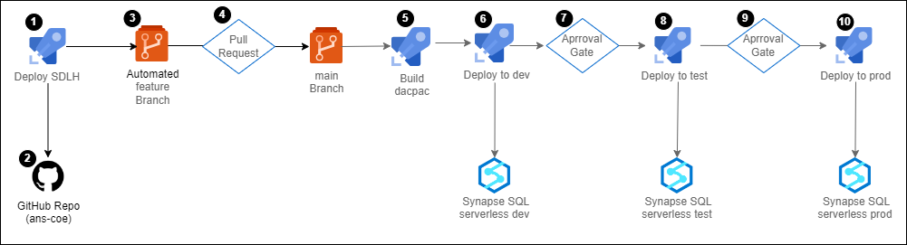

# ANS CoE SDLH (Strategic Data Lakehouse) Synapse Deployment

## Overview
This repo contains synapse config to support automated deployment of the ANS CoE SDLH framework.
The primary use case is to deploy this framework onto an existing ANS Modern Data Platform (MDP) deployment.

## End To End Deployment Flow

## SDLH Benefits
- **All the Data Lakehouse & Cloud benefits**
- **Light & extendable framework**
- **Metadata-driven (JSON Metadata)**
- **Supports Full and Delta/Incremental loads**
- **ETL and Functional logging**